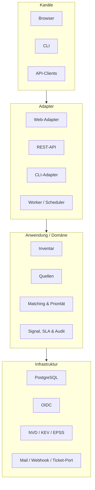

# UMSETZUNGSKONZEPT RiskSignal

**Technische Realisierung des Fachkonzepts v0.2**

| Merkmal | Angabe |
|---|---|
| Dokumentstatus | Entwurf - Grundlage für Detailplanung, Umsetzung und technische Abnahme |
| Version | 0.1 |
| Datum | 8. September 2026 |
| Bezugsdokument | RiskSignal Fachkonzept v0.2 |
| Projektphase | Konzeption; Produkt befindet sich in Entwicklung |
| Verantwortlich | Bruno Schriber / xpera GmbH |

> **Transparenzhinweis:** Dieses Dokument beschreibt die geplante technische Umsetzung. Architektur, Schnittstellen und Abnahmekriterien sind Soll-Vorgaben. Funktionen gelten erst nach Implementierung, erfolgreicher Prüfung und dokumentierter Abnahme als realisiert.

## Dokumentzweck

Das Umsetzungskonzept übersetzt die fachlichen Anforderungen von RiskSignal in eine belastbare technische Lösung. Es legt Architektur, Komponenten, Datenhaltung, Integrationen, Sicherheitsmechanismen, Betriebsfähigkeit, Qualitätssicherung und Umsetzungsreihenfolge so weit fest, dass daraus Arbeitspakete, technische Aufgaben und Abnahmetests abgeleitet werden können.

## Inhaltsübersicht

1. Grundlagen und Architekturentscheide
2. Systemkontext und Zielarchitektur
3. Technologie- und Strukturvorgaben
4. Laufzeit- und Bereitstellungsarchitektur
5. Anwendungskomponenten
6. Domänen- und Datenmodell
7. Datenbank- und Persistenzkonzept
8. Quellenintegration und Verarbeitung
9. Matching, Priorisierung und SLA
10. API-Konzept
11. Browseroberfläche und CLI
12. Identität, Berechtigungen und Sicherheit
13. Audit, Aufbewahrung und Datenschutz
14. Hintergrundverarbeitung und Benachrichtigungen
15. Ticketing-Vorbereitung
16. Observability und Betrieb
17. Test-, Qualitäts- und Lieferkonzept
18. Umsetzungsplan und Lieferobjekte
19. Technische Abnahme und Rückverfolgbarkeit
20. Risiken, Annahmen und offene Detailentscheide
21. Referenzen

---

## 1. Grundlagen und Architekturentscheide

Das Umsetzungskonzept basiert auf dem Fachkonzept v0.2. Die fachlichen Anforderungen FR-001 bis FR-034 und NFR-001 bis NFR-015 bleiben führend. Technische Entscheidungen dürfen diese Vorgaben präzisieren, aber nicht abschwächen. Bei Widersprüchen hat das Fachkonzept Vorrang, bis eine dokumentierte Änderung beschlossen wurde.

### 1.1 Leitprinzipien

- Modularer Monolith statt vorzeitiger Microservice-Aufteilung: klare Modulgrenzen bei einfacher lokaler und privater Bereitstellung.
- API-first: alle fachlichen Kernfunktionen sind über eine versionierte HTTP-API verfügbar.
- Ports und Adapter: externe Quellen, Identitätsanbieter, Benachrichtigungen und spätere Ticketing-Systeme bleiben austauschbar.
- Deterministische Fachlogik: Matching, Priorisierung, Status und Reaktionsfristen sind reproduzierbar und testbar.
- Nachvollziehbarkeit vor Automatisierung: Evidenz, Regelversion und menschliche Entscheidungen bleiben sichtbar.
- Sichere Standardeinstellungen: Online-Betrieb ohne lokalen Authentisierungs-Bypass, minimale Berechtigungen und keine Geheimnisse im Quellcode.
- Wiederholbare Bereitstellung: lokale Demo und private Online-Demo entstehen aus denselben versionierten Artefakten.

### 1.2 Verbindliche technische Entscheide

| ID | Entscheid | Begründung |
|---|---|---|
| ADR-001 | Go-basierter modularer Monolith mit mehreren Prozessmodi aus einem Repository. | Hohe fachliche Kohärenz, geringer Betriebsaufwand und dennoch klare Erweiterungspunkte. |
| ADR-002 | PostgreSQL als alleinige operative Datenbank des MVP. | Transaktionen, Constraints, relationale Nachweise und flexible JSON-Rohdaten ohne zusätzlichen Datenspeicher. |
| ADR-003 | REST/JSON mit OpenAPI 3.1 als externer API-Vertrag. | Breite Interoperabilität, testbarer Vertrag und einfache CLI-/Integrationsnutzung. |
| ADR-004 | Serverseitig gerenderte Weboberfläche mit gezielter progressiver Interaktion. | Go bleibt sichtbar im Gesamtprojekt; weniger Frontend-Komplexität für den MVP. |
| ADR-005 | Persistente Job-Queue und Outbox in PostgreSQL. | Idempotente Hintergrundverarbeitung ohne zusätzlichen Broker im MVP. |
| ADR-006 | OIDC für Benutzer und standardisierte Bearer Tokens für API/Automation. | Keine eigene Passwortverwaltung und saubere Trennung von Identität und Berechtigung. |
| ADR-007 | Containerisierte Bereitstellung; lokal via Compose, private Demo auf einem gehärteten Einzelhost. | Reproduzierbar, wirtschaftlich und passend zur vereinbarten Demo-Stufe. |

### 1.3 Bewusst nicht gewählte Ansätze

- Keine Microservices im MVP: unabhängige Skalierung und getrennte Teams rechtfertigen die zusätzliche Komplexität noch nicht.
- Kein Kafka, RabbitMQ oder Redis als Pflichtkomponente: Jobs und Integrationsereignisse werden zunächst transaktional in PostgreSQL geführt.
- Keine KI-basierte Klassifikation: Priorisierung und Matching bleiben erklärbar und deterministisch.
- Kein Single-Page-Application-Framework als Voraussetzung: die Weboberfläche konzentriert sich auf Triage und Administration.
- Keine produktionsreife Hochverfügbarkeit oder Mehrmandantenfähigkeit im MVP.

---

## 2. Systemkontext und Zielarchitektur

RiskSignal wird als eigenständige Anwendung betrieben. Die Plattform liest ausschliesslich freigegebene öffentliche Quellen und autorisierte Inventardaten. Sie greift nicht aktiv auf die inventarisierten Zielsysteme zu. Benutzer und Automationen bedienen dieselbe Fachlogik über unterschiedliche Adapter.

### 2.1 Systemgrenzen

| Bereich | Innerhalb RiskSignal | Ausserhalb RiskSignal |
|---|---|---|
| Identität | Zuordnung externer Identitäten zu internen Rollen und Berechtigungen. | Passwortverwaltung, MFA-Verfahren und Benutzerlebenszyklus des Identity Providers. |
| Security-Daten | Abruf, Validierung, Normalisierung, Versionierung und Evidenzbildung. | Erstellung und fachliche Verantwortung der öffentlichen Quelldaten. |
| Inventar | Import, Datenqualität, Komponentenmodell, Matching und fachliche Korrekturen. | Discovery, Scanning oder automatische Erfassung produktiver Systeme. |
| Bearbeitung | Priorisierung, Triage, SLA, Status, Zuweisung, Kommentar und Audit. | Patch-Ausführung und operative Änderung an Zielsystemen. |
| Integrationen | Versionierte API, Benachrichtigungs- und Ticketing-Ports. | Konkreter produktiver Ticketing-Adapter im MVP. |

### 2.2 Logische Architektur



*Abbildung 1: Alle Bedienkanäle nutzen gemeinsame Anwendungsdienste und Domänenregeln. Externe Systeme werden ausschliesslich über Adapter angebunden.*

### 2.3 Verantwortungsgrenzen der Schichten

- Kanäle präsentieren Daten oder starten Anwendungsfälle. Sie enthalten keine Priorisierungs-, Matching- oder Statuslogik.
- Adapter übersetzen HTTP, CLI, OIDC, Datenbank- und Quellprotokolle in interne Ports.
- Anwendungsdienste koordinieren Transaktionen, Berechtigungen, Domänenobjekte und Ereignisse.
- Die Domäne enthält Regeln und Zustandsübergänge ohne Abhängigkeit von HTTP, Datenbank oder Benutzeroberfläche.
- Infrastrukturadapter realisieren Persistenz und Kommunikation. Ihr Ausfall darf fachliche Konsistenz nicht verletzen.

---

## 3. Technologie- und Strukturvorgaben

Versionen werden in Build und Lock-Dateien fixiert. Das Projekt verwendet bei Umsetzungsstart eine unterstützte stabile Go-Version. Abhängigkeiten werden bewusst begrenzt und müssen Lizenz-, Wartungs- und Sicherheitsprüfungen bestehen.

### 3.1 Technologiestack

| Bereich | Vorgabe | Einsatz |
|---|---|---|
| Programmiersprache | Go, ein Repository und ein Go-Modul. | API, Web, CLI, Worker, Scheduler und Fachlogik. |
| HTTP | Go net/http mit leichtgewichtigem Router. | REST-Endpunkte, Middleware, Health und serverseitige Webrouten. |
| API-Vertrag | OpenAPI 3.1, schema-first. | Dokumentation, Contract-Tests und optional generierte Clients/Server-Typen. |
| Persistenz | PostgreSQL; Zugriff über pgx und generierte, typisierte SQL-Abfragen. | Fachobjekte, Jobs, Outbox, Audit, Rohdaten und Suchindizes. |
| Migrationen | Vorwärtsgerichtete, versionierte SQL-Migrationen. | Reproduzierbarer Schemaaufbau und nachvollziehbare Datenänderungen. |
| Web | Go-Templates und progressive HTML-Interaktion; CSS-Build als versioniertes Artefakt. | Dashboard, Triage, Details, Quellenmonitor und Administration. |
| CLI | Go-CLI mit konsistenter Unterbefehlsstruktur. | Importe, Reprocessing, Demo-Seeding, Wartung und Diagnose. |
| Authentisierung | OIDC Authorization Code Flow mit PKCE; validierte Bearer Tokens für API und Automation. | Browser, menschliche CLI-Nutzung und technische Identitäten. |
| Observability | Strukturierte Logs, Prometheus-kompatible Metriken und OpenTelemetry-kompatible Traces. | Betrieb, Fehleranalyse und Leistungsnachweise. |
| Bereitstellung | OCI-Container, Compose für lokal und versionierte Konfiguration für private Demo. | Reproduzierbare Laufzeitumgebungen. |

### 3.2 Repository-Struktur

```
/cmd
  /risksignal-server       # API und Web
  /risksignal-worker       # Jobs, Scheduler, Outbox
  /risksignal              # CLI
/internal
  /domain                  # Entitäten, Werteobjekte, Regeln
  /application             # Use Cases, Ports, Transaktionen
  /adapters
     /httpapi /web /cli
     /postgres /oidc /notify
     /sources/nvd /sources/kev /sources/epss
  /platform                # Konfiguration, Logging, Health
/api/openapi               # OpenAPI-Vertrag
/db/migrations /db/queries
/web/templates /web/assets
/testdata /docs /deploy
```

Pakete unter internal verhindern eine unkontrollierte externe Verwendung. Domänenmodule dürfen keine Adapter importieren. Abhängigkeiten zeigen von aussen nach innen; konkrete Adapter implementieren Ports der Anwendungsschicht.

### 3.3 Konfigurationsprinzip

- Konfiguration erfolgt über versionierte Defaults, Umgebungsvariablen und optional eingehängte Konfigurationsdateien.
- Geheimnisse werden ausschliesslich zur Laufzeit injiziert und weder im Repository noch in Diagnoseausgaben gespeichert.
- Beim Start werden Pflichtwerte, URLs, Zeitdauern und gegenseitig ausschliessende Modi validiert.
- Produktions- oder Demo-Online-Modus verweigert den Start, wenn der lokale Authentisierungs-Bypass aktiviert ist.
- Sicherheitsrelevante Konfigurationswerte werden mit Herkunft, jedoch ohne geheimen Inhalt, im Startprotokoll ausgewiesen.

---

## 4. Laufzeit- und Bereitstellungsarchitektur

Aus demselben Quellstand entstehen drei ausführbare Programme. Server und Worker dürfen für die lokale Demo gemeinsam gestartet werden; ihre Verantwortungen bleiben im Code getrennt. In der privaten Online-Demo laufen sie als getrennte Prozesse beziehungsweise Container.

### 4.1 Prozessrollen

| Prozess | Verantwortung | Skalierungs- und Fehlergrenze |
|---|---|---|
| risksignal-server | REST-API, Weboberfläche, OIDC-Sitzungen, synchrone Anwendungsfälle und Health-Endpunkte. | Zustandslos ausser kurzlebigem Cache; mehrere Instanzen später möglich. |
| risksignal-worker | Quellenabrufe, Normalisierung, Matching, Priorisierung, SLA-Eskalation, Retention, Outbox und Benachrichtigungen. | Jobs werden geleast; ein Abbruch wird nach Lease-Ablauf sicher fortgesetzt. |
| risksignal CLI | Administrative und automatisierte Befehle gegen API oder kontrolliert gegen lokale Wartungsports. | Nicht-interaktiv nutzbar; Exit-Codes und maschinenlesbare Ausgabe. |
| PostgreSQL | Transaktionale Quelle für Fachzustand, Jobs, Audit und Integrationsereignisse. | Regelmässiges Backup; Restore ist Abnahmekriterium. |

### 4.2 Lokale Umgebung

- Compose startet PostgreSQL, Server, Worker, lokalen OIDC-Testanbieter und Mail-Testserver.
- Ein Seed-Befehl erzeugt Benutzerrollen, synthetisches Inventar, Quellenstände und erwartete P1-P4-Signale.
- Persistente Volumes können für einen vollständigen Neustart bewusst beibehalten oder explizit neu erzeugt werden.
- Standardmässig werden nur Loopback-Ports veröffentlicht. Externe Erreichbarkeit ist eine bewusste Konfigurationsänderung.

### 4.3 Private Online-Demoumgebung

- Ein gehärteter Linux-Einzelhost betreibt Reverse Proxy, Server, Worker und PostgreSQL in getrennten Containern.
- Nur HTTPS ist öffentlich erreichbar. Datenbank, Worker, Verwaltungsports und Metriken sind nicht direkt exponiert.
- OIDC ist verpflichtend; Rollen werden aus freigegebenen Claims auf interne Rollen abgebildet.
- Backups werden verschlüsselt und ausserhalb des Laufzeithosts abgelegt. Restore-Tests erfolgen wiederkehrend.
- Die Umgebung verwendet ausschliesslich synthetische oder ausdrücklich freigegebene Inventardaten.

### 4.4 Deployment-Ablauf

1. Build erzeugt signierbare, unveränderliche Container-Images und eine SBOM.
2. Vor dem Rollout werden Datenbanksicherung, Konfigurationsvalidierung und Migrationsplan geprüft.
3. Migrationen laufen einmalig mit exklusiver Sperre und brechen bei unerwartetem Schema ab.
4. Server und Worker werden mit Health- und Readiness-Prüfungen aktualisiert.
5. Smoke-Tests prüfen Anmeldung, API, Quellenmonitor und einen lesenden Signalabruf.
6. Rollback verwendet das vorherige Image. Nicht abwärtskompatible Datenmigrationen benötigen einen eigenen Rücksetzungsplan.

---

## 5. Anwendungskomponenten

| Komponente | Kernverantwortung | Wichtige Ausgaben |
|---|---|---|
| Source Registry | Quellenkonfiguration, Zeitplan, Cursor, Status und Abrufhistorie. | SourceRun, Rohdatensatz, Health-Status. |
| Ingestion | HTTP-Abruf, technische Validierung, Hashing, Dekompression und Quarantäne. | Unveränderter Payload, Importmetrik, Fehlergrund. |
| Normalization | Quellenspezifische Felder in Schwachstelle, Evidenz, Produkt und Bewertung überführen. | Versionierte normalisierte Objekte. |
| Inventory | Assets, Komponenten, Importe, Datenqualität und Lebenszyklus verwalten. | Aktueller Inventarstand und Importreport. |
| Matching | Komponenten gegen Produkt- und Versionsangaben abgleichen. | Zuordnung, Methode, Konfidenz und Begründung. |
| Prioritization | P1-P4 aus Evidenz, Zuordnung und Assetkontext ableiten. | Priorität, Faktorenset und Regelversion. |
| Signal Workflow | Status, Owner, Fristen, Kommentare und menschliche Entscheidungen. | Risikosignal und Zustandsereignisse. |
| SLA | Reaktionsziele, verbleibende Zeit, Pausen, Verletzungen und Eskalationen. | Deadlines und SLA-Ereignisse. |
| Notification | Benachrichtigungen vorbereiten und über Adapter zustellen. | In-App-, Mail- oder Webhook-Zustellung. |
| Audit & Retention | Nachweise unveränderbar protokollieren und Aufbewahrungsregeln vollziehen. | Auditereignisse und Löschprotokolle. |

### 5.1 Transaktionsgrenzen

Jeder fachliche Befehl wird in genau einer Datenbanktransaktion verarbeitet. Zustandsänderung, Auditereignis und zugehöriges Outbox-Ereignis werden atomar gespeichert. Externe Zustellungen erfolgen erst nach Commit. Dadurch kann ein fehlgeschlagener Mail-, Webhook- oder späterer Ticketing-Aufruf den fachlichen Zustand nicht teilweise zurücksetzen.

### 5.2 Fehlersemantik

- Validierungsfehler: fachlich verständliche Meldung mit Feldbezug; keine Wiederholung.
- Konflikt: Optimistic-Locking- oder Zustandskonflikt; Client liest den aktuellen Stand und entscheidet erneut.
- Temporärer Infrastrukturfehler: begrenzte Wiederholung mit Backoff und Jitter.
- Dauerhafter Integrationsfehler: Quarantäne beziehungsweise Dead-Letter-Zustand mit manueller Wiederaufnahme.
- Unerwarteter interner Fehler: neutrale externe Meldung mit Korrelations-ID; technische Details nur im geschützten Log.

---

## 6. Domänen- und Datenmodell

Das Domänenmodell trennt externe Aussagen, autorisierten Inventarkontext und daraus abgeleitete Arbeitseinheiten. Eine externe Meldung wird niemals direkt zum Beweis einer konkreten Betroffenheit. Erst eine nachvollziehbare Zuordnung zwischen Schwachstelle und Komponente erzeugt ein Risikosignal.

### 6.1 Aggregate und Verantwortungen

| Aggregat | Identität und Zustand | Konsistenzregeln |
|---|---|---|
| Source | source_id; Typ, URL, Zeitplan, Aktivstatus, Vertrauensprofil und Cursor. | Nur freigegebene Typen; Änderungen auditiert; Geheimnisse nur als Referenz. |
| SourceRun | run_id; Quelle, Start/Ende, Cursor, Zähler, Ergebnis und Fehler. | Genau ein Endzustand; Cursor erst nach erfolgreichem Commit fortschreiben. |
| Vulnerability | vulnerability_id; CVE, Beschreibungen, CVSS und Referenzen. | CVE normalisiert und eindeutig; Quellenaussagen bleiben getrennte Evidenzen. |
| Evidence | evidence_id; Typ, Aussage, Quelle, Gültigkeitszeit, Rohdatenreferenz und Hash. | Unveränderbar; Korrekturen erzeugen neue Version oder neue Evidenz. |
| Asset | asset_id; Name, Typ, Umgebung, Kritikalität, Exposition, Owner und Lebenszyklus. | ID je Inventarquelle eindeutig; deaktivierte Assets bleiben historisch referenzierbar. |
| Component | component_id; Asset, Hersteller, Produkt, Version, CPE, Alias, Image/Digest. | Gehört genau zu einem Asset; Identifier werden normalisiert, Original bleibt erhalten. |
| Match | match_id; Komponente, Schwachstelle, Methode, Konfidenz, Gründe und Regelversion. | Automatische Neuberechnung überschreibt keine menschliche Entscheidung. |
| RiskSignal | signal_id; Match, Priorität, Status, Owner, Fristen und Entscheidung. | Erlaubte Statusübergänge; fachliche Übersteuerung nur mit Begründung. |
| SLAClock | sla_clock_id; Zieltyp, Start, Deadline, Pause, Erfüllung und Verletzung. | Deadline reproduzierbar; Pause nur berechtigt und begründet. |
| AuditEvent | audit_id; Akteur, Zeit, Aktion, Ziel, vorher/nachher und Korrelations-ID. | Append-only; keine fachliche Löschung vor Ende der Aufbewahrung. |

### 6.2 Wertobjekte und kontrollierte Vokabulare

| Wertobjekt | Zulässige Werte / Format | Bemerkung |
|---|---|---|
| AssetType | server_vm, application_framework, container_image, network_security, cloud_saas | Erweiterbar durch Migration und API-Versionierung. |
| Environment | production, staging, test, development, unknown | Produktiv erhöht nicht automatisch die Priorität, ist aber sichtbarer Kontext. |
| Criticality | critical, high, normal, low, unknown | Unknown führt zu Datenqualitätswarnung. |
| Exposure | internet, internal, isolated, unknown | Unknown darf nicht als intern interpretiert werden. |
| Confidence | high, medium, low, none | Aus einem nachvollziehbaren Matching-Score abgeleitet. |
| Priority | P1, P2, P3, P4 | Regelversion und beitragende Faktoren werden gespeichert. |
| SignalStatus | new, in_review, action_planned, resolved, accepted, not_affected | Statuswechsel gemäss Zustandsmatrix. |
| Timestamp | UTC, RFC 3339 nach aussen | Oberfläche lokalisiert Anzeige, nicht Speicherung. |

### 6.3 Signal-Zustandsmodell

| Von | Nach | Bedingung |
|---|---|---|
| new | in_review | Analyst oder berechtigter Verantwortlicher übernimmt die Prüfung. |
| new / in_review | action_planned | Betroffenheit plausibel oder bestätigt; Owner und nächste Massnahme vorhanden. |
| new / in_review | not_affected | Begründung und fachliche Evidenz dokumentiert. |
| in_review / action_planned | accepted | Akzeptanzentscheid, Begründung, Entscheider und optional Gültigkeitsfrist vorhanden. |
| action_planned | resolved | Massnahme oder Verifikation dokumentiert; Abschlusszeit wird gesetzt. |
| resolved / accepted / not_affected | in_review | Wiedereröffnung mit Begründung; neue SLA-Behandlung gemäss Regel. |

Abgeschlossene Zustände sind resolved, accepted und not_affected. Der Abschlusszeitpunkt startet die fünfjährige Aufbewahrungsfrist. Eine Wiedereröffnung beendet den laufenden Retention-Countdown und erzeugt ein neues Auditereignis.

---

## 7. Datenbank- und Persistenzkonzept

PostgreSQL ist die transaktionale Quelle des MVP. Normalisierte Fachdaten werden relational modelliert; unveränderte externe Nutzdaten können zusätzlich als JSONB beziehungsweise komprimierte Rohdaten gespeichert werden. Datenbank-Constraints sichern zentrale Invarianten unabhängig von der Anwendung.

### 7.1 Kernschema

| Tabelle | Schlüssel / zentrale Spalten | Indizes und Constraints |
|---|---|---|
| sources | id, type, name, endpoint, schedule, enabled, cursor, config | unique(type, name); URL- und Typprüfung. |
| source_runs | id, source_id, started_at, finished_at, status, counters, cursor_before/after | index(source_id, started_at desc); gültiger Endzustand. |
| raw_records | id, source_id, external_id, content_hash, payload, fetched_at | unique(source_id, external_id, content_hash); Hashindex. |
| vulnerabilities | id, cve_id, summary, published_at, modified_at | unique(cve_id); Volltextindex optional. |
| evidences | id, vulnerability_id, raw_record_id, type, observed_at, value | unique(raw_record_id, type, value_hash). |
| assets | id, external_id, source, type, name, environment, criticality, exposure, owner | unique(source, external_id); Filterindizes. |
| components | id, asset_id, vendor, product, version, cpe, purl, image, digest | index auf normalisierten Produktfeldern, CPE, purl und Digest. |
| matches | id, vulnerability_id, component_id, method, score, confidence, rule_version | unique(vulnerability_id, component_id, rule_version). |
| risk_signals | id, match_id, priority, status, owner, due_at, closed_at, version | Arbeitslistenindizes; optimistic locking über version. |
| sla_clocks | id, signal_id, target, started_at, deadline_at, fulfilled_at, paused_seconds | unique(signal_id, target); Deadline-Index. |
| audit_events | id, aggregate_type/id, actor, action, occurred_at, before/after, correlation_id | Append-only; index Ziel und Zeit. |
| jobs / outbox | id, type, payload, status, available_at, lease_until, attempts, dedupe_key | unique(dedupe_key); index(status, available_at). |

### 7.2 Identitäten und Zeit

- Interne Primärschlüssel sind zeitlich ungeordnete UUIDs oder ein gleichwertiges nicht erratbares Format.
- Externe IDs werden separat gespeichert und niemals als alleiniger interner Primärschlüssel verwendet.
- Alle Zeitstempel werden als timestamptz in UTC gespeichert. Fachliche Quelldaten behalten zusätzlich ihren Originalzeitpunkt.
- Die Systemuhr wird über einen injizierbaren Clock-Port verwendet, damit SLA- und Retention-Tests ohne reales Warten möglich sind.

### 7.3 Transaktionen, Nebenläufigkeit und Idempotenz

- Schreibende API-Befehle verwenden optimistic locking. Veraltete Versionen ergeben HTTP 409 statt stiller Überschreibung.
- Importe verwenden natürliche Eindeutigkeiten und Inhalts-Hashes. Identische Quelldaten erzeugen keine neuen Fachobjekte.
- Worker reservieren Jobs mit Datenbank-Locks und zeitlich begrenzten Leases. Abgelaufene Leases werden wieder verfügbar.
- Outbox-Ereignisse werden in derselben Transaktion wie der Fachzustand geschrieben und mindestens einmal zugestellt.
- Empfänger verarbeiten Ereignisse idempotent anhand einer unveränderlichen Event-ID oder eines Deduplizierungsschlüssels.

### 7.4 Migrationen und Datenpflege

- Jede Schemaänderung ist eine nummerierte, unveränderliche SQL-Migration im Repository.
- Migrationen laufen vor Applikationsstart und werden mit Prüfsumme protokolliert.
- Destruktive Änderungen folgen Expand-Migrate-Contract: neue Struktur einführen, Daten migrieren, Nutzung umstellen, alte Struktur später entfernen.
- Produktive Datenbereinigungen sind versionierte, wiederholbare Wartungsbefehle mit Dry-Run, Zählern und Auditnachweis.

---

## 8. Quellenintegration und Verarbeitung

Jeder Quellenadapter implementiert denselben Port: Planen, Abrufen, technische Metadaten liefern, Datensätze streamen und einen reproduzierbaren Cursor fortschreiben. Parser erzeugen zunächst quellenspezifische DTOs; erst der Normalizer bildet Domänenobjekte.

### 8.1 Allgemeine Verarbeitungskette

1. Quelle und Abrufparameter aus freigegebener Konfiguration laden.
2. HTTP-Anfrage mit Timeout, User-Agent, optionalem API-Key sowie begrenztem Retry ausführen.
3. Antwortstatus, Content-Type, Grösse und technische Integrität validieren.
4. Rohinhalt unverändert oder nachvollziehbar komprimiert speichern und hashen.
5. Datensätze streamend parsen; einzelne Fehler mit Position und Grund in Quarantäne stellen.
6. Datensätze normalisieren, vorhandene Fachobjekte idempotent aktualisieren und Evidenzen versionieren.
7. Betroffene Produktzuordnungen für Matching markieren; keine globale Vollberechnung ohne Anlass.
8. Laufstatistik, Cursor und Datenalter committen; anschliessend Matching-Jobs auslösen.

### 8.2 NVD/CVE-Adapter

- Verwendet die NVD Vulnerability API 2.0 und inkrementelle Zeitfenster auf dem letzten Änderungszeitpunkt.
- Paginierung wird vollständig verarbeitet. Cursor wird erst nach einem erfolgreichen Lauf fortgeschrieben.
- Ein kleines Überlappungsfenster verhindert Lücken an Zeitgrenzen; Idempotenz entfernt Wiederholungen.
- CVE-ID, Beschreibungen, CVSS-Metriken, CPE-Konfigurationen, Referenzen, Publikations- und Änderungszeit werden übernommen.
- NVD-Rate-Limits werden respektiert. API-Key ist optional konfigurierbar und wird ausschliesslich als Secret injiziert.

### 8.3 CISA-KEV-Adapter

- Lädt den offiziellen KEV-Katalog als versionierten Gesamtdatenbestand.
- Der gesamte Inhalt erhält einen Hash; unveränderte Dateien werden als erfolgreicher Lauf ohne fachliche Änderungen verbucht.
- CVE-ID, Hersteller, Produkt, Schwachstellenname, Aufnahmedatum, bekannte Ausnutzung, erforderliche Massnahme und Frist werden als Evidenz gespeichert.
- Entfernte oder geänderte Katalogeinträge werden historisiert und nicht stillschweigend aus bestehenden Entscheidungen entfernt.

### 8.4 FIRST-EPSS-Adapter

Für den täglichen Massenabgleich wird die vollständige tägliche CSV-Datei verwendet. Die EPSS-API bleibt für gezielte Einzelabfragen und Diagnose vorgesehen; FIRST weist ausdrücklich darauf hin, dass die API nicht für die laufende Bulk-Synchronisation gedacht ist.

- CSV wird streamend dekomprimiert und verarbeitet; Download muss nicht vollständig im Arbeitsspeicher liegen.
- CVE, Wahrscheinlichkeit, Perzentil, Publikationsdatum und Modellversion werden gespeichert.
- Historische Werte werden nur für CVEs mit relevantem Inventarbezug dauerhaft fortgeschrieben; der aktuelle Vollbestand bleibt ersetzbar.
- Fehlende Werte werden als fehlend und nicht als null Prozent interpretiert.

### 8.5 Synthetische Quelle und BACS/NCSC-Erweiterung

Die synthetische Quelle implementiert denselben Adaptervertrag und liefert deterministische Referenzfälle für alle Prioritäten, Matching-Konfidenzen und Fehlerzustände. Nach dem MVP wird BACS/NCSC Schweiz als erster zusätzlicher Adapter umgesetzt. Bevorzugt werden strukturierte offizielle Feeds oder APIs. Fehlen diese, wird ein kontrollierter manueller Import mit Herkunftsnachweis umgesetzt; aggressives Web-Scraping ist ausgeschlossen.

### 8.6 Quarantäne und Wiederverarbeitung

| Status | Bedeutung | Aktion |
|---|---|---|
| new | Datensatz konnte nicht verarbeitet werden. | Fehlergrund, Quelle, Position und Payload-Hash anzeigen. |
| acknowledged | Administrator hat den Fehler bewertet. | Kommentar und Verantwortlichkeit erfassen. |
| ready_for_retry | Adapter, Regel oder Daten wurden korrigiert. | Gezielte Wiederverarbeitung mit neuer Parser-/Regelversion. |
| resolved | Datensatz erfolgreich verarbeitet oder begründet verworfen. | Ergebnis und Verbindung zum neuen Fachobjekt dokumentieren. |

---

## 9. Matching, Priorisierung und SLA

Matching und Priorisierung sind zwei getrennte Schritte. Matching beantwortet, wie verlässlich eine Schwachstelle einer inventarisierten Komponente zugeordnet werden kann. Priorisierung bewertet anschliessend die Dringlichkeit unter Einbezug von Ausnutzung, technischer Schwere und Assetkontext.

### 9.1 Normalisierung von Produktdaten

- Hersteller- und Produktnamen werden Unicode-normalisiert, getrimmt und für Vergleiche kleingeschrieben; Originalwerte bleiben erhalten.
- Punktuation, bekannte Rechtsformen und kontrollierte Schreibvarianten werden über versionierte Aliasregeln behandelt.
- CPE und Package URL werden syntaktisch validiert und in ihre Bestandteile zerlegt.
- Container-Images werden in Registry, Repository, Tag und Digest zerlegt. Ein Digest ist stärker als ein veränderlicher Tag.
- Versionen werden nicht lexikografisch verglichen. Der Adapter wählt je Produkttyp eine geeignete Semantik; unbekannte Formate reduzieren die Konfidenz.

### 9.2 Matching-Stufen

| Score | Methode | Voraussetzung | Konfidenz |
|---|---|---|---|
| 100 | Exact identifier | CPE oder purl stimmt und Version liegt eindeutig im betroffenen Bereich. | high |
| 95 | Container digest | Image-Repository und unveränderlicher Digest stimmen mit gesicherter Evidenz. | high |
| 90 | Alias + exact version | Kontrollierter Hersteller-/Produktalias und exakte Version stimmen. | high |
| 80 | Canonical product + range | Normalisiertes Produkt stimmt; Version liegt nachweisbar im Bereich. | high |
| 65 | Product + uncertain version | Produkt stimmt; Version fehlt oder Bereich ist nicht eindeutig interpretierbar. | medium |
| 55 | Controlled alias only | Kontrollierter Alias stimmt, Versionsbezug fehlt. | medium |
| 1-54 | Candidate | Nur schwache Namensähnlichkeit oder unvollständige Evidenz. | low |
| 0 | No match | Produkt oder Version ist nachweislich nicht betroffen. | none |

Fuzzy Matching erzeugt nur Kandidaten und nie automatisch eine hohe Konfidenz. Manuelle Korrekturen werden als separate DecisionRule gespeichert. Eine Ausschlussregel benötigt Begründung, Gültigkeitsbereich und Urheber; sie bleibt auch nach einer automatischen Neuberechnung wirksam, bis sie abgelaufen oder aufgehoben ist.

### 9.3 Deterministische Prioritätsregeln

| Klasse | Regel des MVP | Hinweis |
|---|---|---|
| P1 | Konfidenz high UND KEV=true UND (Kritikalität critical/high ODER Exposition internet). | Aktive Benachrichtigung und sofortige SLA-Uhr. |
| P2 | Konfidenz high UND mindestens einer: KEV, CVSS >= 9.0, EPSS-Perzentil >= 0.95; ODER Konfidenz medium UND KEV UND kritischer/exponierter Kontext. | Zeitnahe Bewertung; Unsicherheit bleibt sichtbar. |
| P3 | Plausible Zuordnung mit medium/low oder high ohne starken Dringlichkeitsindikator. | Zusätzliche Abklärung erforderlich. |
| P4 | Keine bestätigte Inventarzuordnung oder rein informativer Hinweis. | Beobachtung; keine Betroffenheitsbehauptung. |

Die Regeln werden als versionierte Konfiguration mit stabiler Regel-ID gespeichert. Jedes Signal enthält den verwendeten Regelstand und die einzelnen Faktoren. Eine fachliche Umstufung setzt Begründung, Akteur und Zeit; der berechnete Ausgangswert bleibt sichtbar.

### 9.4 SLA-Uhren

| Priorität | Benachrichtigung | Bestätigung | Bewertung | Entscheid |
|---|---|---|---|---|
| P1 | 5 Min. | 15 Min. | 60 Min. | 4 Std. |
| P2 | 15 Min. | 1 Std. | 4 Std. | 24 Std. |
| P3 | Kein Paging | 24 Std. | 72 Std. | Nach Bewertung |
| P4 | Kein Paging | Keine einzelne | Wöchentlich | Bei Bedarf |

- SLA-Start ist der Zeitpunkt, an dem ein neues oder höher priorisiertes Signal fachlich committed wurde.
- Eine Heraufstufung erzeugt fehlende strengere SLA-Uhren ab Heraufstufungszeit; bereits verstrichene Bearbeitungszeit bleibt im Audit sichtbar.
- Bestätigung erfolgt explizit durch eine berechtigte Person. Reines Öffnen der Detailseite genügt nicht.
- Eine Pause setzt Grund, Akteur und optional erwartetes Ende voraus. Pausen werden nicht rückwirkend erfasst.
- P1 wird bei fehlender Bestätigung nach 15 Minuten einmalig eskaliert und danach gemäss konfigurierter Wiederholungsregel erinnert.
- Demo-Zeitprofile skalieren nur Dauern; Status-, Eskalations- und Auditlogik bleiben identisch.

### 9.5 Neuberechnung und Stabilität

Neue Evidenz oder Inventaränderungen erzeugen gezielte Recompute-Jobs. Eine Prioritätsänderung wird nur gespeichert, wenn sich Faktorenset, Regelversion oder Ergebnis verändert. Geschlossene Signale werden bei neuer relevanter Evidenz nicht still geändert; das System erzeugt einen Wiedereröffnungsvorschlag oder ein neues Signal gemäss Deduplizierungsregel.
---

## 10. API-Konzept

Die API ist der vollständige externe Fachvertrag. Sie wird schema-first mit OpenAPI 3.1 beschrieben. Browser- und CLI-Adapter teilen die gleichen Anwendungsdienste; automatisierte Integrationen können alle fachlichen MVP-Funktionen über die API ausführen.

### 10.1 Konventionen

- Basis-Pfad /api/v1; Breaking Changes erfordern eine neue Major-API-Version.
- JSON-Feldnamen in snake_case; Zeitangaben in RFC 3339 UTC; IDs als Strings.
- Listen verwenden cursorbasierte Pagination, stabile Sortierung und explizite Filter.
- Schreibbefehle akzeptieren Idempotency-Key, wo Wiederholung durch Clients realistisch ist.
- Optimistic Locking erfolgt mit Version beziehungsweise ETag/If-Match.
- Fehler folgen RFC 9457 Problem Details und enthalten type, title, status, detail, instance und correlation_id.
- OpenAPI-Dokument und Beispiele werden im Build validiert; Implementierung und Vertrag werden durch Contract-Tests abgeglichen.

### 10.2 Ressourcen und Kernendpunkte

| Ressource | Endpunkte | Zweck |
|---|---|---|
| System | GET /health/live; GET /health/ready; GET /version | Betriebsprüfung und Build-Nachweis. |
| Sources | GET/POST /sources; GET/PATCH /sources/{id}; POST /sources/{id}/runs | Quellen verwalten und Läufe starten. |
| Runs | GET /source-runs; GET /source-runs/{id}; POST /source-runs/{id}/retry | Importstatus, Zähler und kontrollierte Wiederholung. |
| Quarantine | GET /quarantine; GET/PATCH /quarantine/{id}; POST /quarantine/{id}/reprocess | Fehler bewerten und erneut verarbeiten. |
| Inventory | POST /inventory/imports; GET /inventory/imports/{id}; POST /inventory/imports/{id}/commit | Voransicht, Validierung und bestätigter Import. |
| Assets | GET /assets; GET/PATCH /assets/{id}; GET /assets/{id}/components | Inventar suchen, prüfen und verwalten. |
| Signals | GET /signals; GET /signals/{id}; POST /signals/{id}/commands | Triage, Status, Owner, Kommentar, Umstufung und Abschluss. |
| Audit | GET /audit-events; GET /signals/{id}/audit | Nachweis nach Ziel, Akteur, Aktion und Zeitraum. |
| Administration | GET /roles; GET/PATCH /users/{id}/roles; GET/PATCH /settings/{key} | Rollen und freigegebene Konfiguration. |
| Exports | POST /exports; GET /exports/{id}; GET /exports/{id}/download | Asynchroner CSV-/JSON-Export mit Filterkontext. |

### 10.3 Command-Endpunkt für Signale

Zustandsänderungen werden als explizite Befehle statt als beliebige Objekt-Patches modelliert. Dadurch bleiben Berechtigungen, Pflichtfelder und Auditsemantik eindeutig.

```http
POST /api/v1/signals/{signal_id}/commands
{
  "command": "change_status",
  "expected_version": 7,
  "status": "action_planned",
  "reason": "Betroffenheit durch Systemverantwortung bestätigt",
  "owner_id": "...",
  "due_at": "2026-09-09T12:00:00Z"
}
```

### 10.4 Filter, Suche und Exporte

- Signalfilter: priority, status, asset_id, asset_type, product, cve, owner_id, source_id, created_from/to, sla_state und free_text.
- Standardsortierung: Priorität aufsteigend P1-P4, danach nächste SLA-Deadline und Erstellzeit.
- Exporte laufen als Jobs, frieren Filter und Erstellzeit ein und enthalten Schema- und Regelversion.
- CSV-Ausgaben neutralisieren führende Formelzeichen. Downloads sind kurzlebig autorisiert und werden auditiert.

### 10.5 API-Berechtigungen

Jeder Endpunkt deklariert mindestens eine Permission. Die Middleware authentisiert, die Anwendungsschicht autorisiert erneut am konkreten Anwendungsfall. Dadurch kann ein alternativer Adapter die Fachberechtigung nicht umgehen. Objektbezogene Einschränkungen - etwa nur zugewiesene Signale für Systemverantwortliche - werden im Query- und Command-Pfad konsistent angewendet.

---

## 11. Browseroberfläche und CLI

Browser und CLI sind gleichwertige Adapter zu denselben Anwendungsfällen. Die Weboberfläche optimiert die tägliche Triage und Administration. Die CLI optimiert wiederholbare, automatisierte und diagnostische Abläufe.

### 11.1 Web-Navigation

| Ansicht | Inhalt | Primäre Aktionen |
|---|---|---|
| Dashboard | Offene Signale nach P1-P4, SLA-Zustand, Alter, Owner, Quellenstatus und Datenqualität. | Filtern, Triage-Liste öffnen, kritische Zustände erkennen. |
| Triage | Dichte, filterbare Signal-Arbeitsliste mit Priorität, CVE, Asset, Konfidenz, Status und Deadline. | Bestätigen, zuweisen, Status setzen, Stapelauswahl für zulässige Aktionen. |
| Signaldetail | Faktoren, Match-Begründung, Evidenzen, Asset/Komponenten-Kontext, SLA und Audit-Timeline. | Entscheiden, kommentieren, umstufen, abschliessen, wiedereröffnen. |
| Quellenmonitor | Letzter Lauf, Datenalter, Zähler, Fehler, Rate-Limit und Quarantäne. | Lauf starten, Fehler anerkennen, Wiederverarbeitung. |
| Inventar | Assets, Komponenten, Importstatus, Datenqualität und letzte Verifikation. | Import vorprüfen/bestätigen, Asset suchen und korrigieren. |
| Administration | Benutzerrollen, Quellen, Regeln, Zeitprofile und Retention-Konfiguration. | Freigegebene Werte ändern; Auswirkungen vor Bestätigung anzeigen. |

### 11.2 UX-Leitplanken

- Priorität wird nie nur durch Farbe vermittelt; Text, Symbol und Begründung sind zusätzlich sichtbar.
- Jede automatische Aussage unterscheidet zwischen bestätigt, wahrscheinlich, möglich und nicht nachgewiesen.
- Destruktive oder weitreichende Aktionen zeigen Zielumfang und erfordern eine Bestätigung.
- Listen behalten Filter in der URL, damit Ansichten reproduzierbar und teilbar bleiben.
- Tastaturnavigation, sichtbarer Fokus, ausreichender Kontrast und semantisches HTML sind Mindestanforderungen.
- Zeitkritische P1/P2-Zustände aktualisieren sich progressiv, ohne die gesamte Seite neu zu laden.

### 11.3 CLI-Befehlsmodell

```
risksignal auth login|status
risksignal source list|run|status
risksignal inventory validate|preview|import
risksignal signal list|show|ack|assign|transition|comment
risksignal quarantine list|ack|reprocess
risksignal export create|download
risksignal maintenance migrate|retention|recompute
risksignal demo seed|reset|run
risksignal diagnose config|connectivity|health
```

- Standardausgabe ist menschenlesbar; --output json liefert stabile maschinenlesbare Strukturen.
- Nicht-interaktive Befehle benötigen --yes oder vollständige Parameter und lesen keine verdeckten Defaults aus einem Terminaldialog.
- Exit-Code 0 bedeutet Erfolg; definierte Codes unterscheiden Validierung, Authentisierung, Berechtigung, Konflikt und Infrastrukturfehler.
- Dry-Run ist für Inventarimporte, Retention, Migrationen, Recompute und Datenbereinigung verpflichtend.
- CLI-Tokens werden über OIDC bezogen oder als kurzlebige Automation-Credentials injiziert und niemals in Logs ausgegeben.

---

## 12. Identität, Berechtigungen und Sicherheit

Der Identity Provider authentisiert Benutzer; RiskSignal autorisiert Aktionen. Das System speichert nur stabile externe Subject-ID, Anzeigename, optionale E-Mail für Benachrichtigungen, interne Rollen und den letzten Anmeldezeitpunkt. Passwörter werden nicht implementiert oder gespeichert.

### 12.1 OIDC-Abläufe

| Nutzung | Ablauf | Sicherheitsvorgaben |
|---|---|---|
| Browser | Authorization Code Flow mit PKCE; Callback erzeugt serverseitige Sitzung. | State, Nonce, PKCE, Issuer, Audience, Signatur und Ablauf prüfen; sichere SameSite-Cookies. |
| Menschliche CLI | Device Authorization Flow, falls der gewählte Provider ihn unterstützt; sonst Browser-Login über Loopback Callback. | Kein Passwort in CLI; Token im geschützten OS Credential Store oder nur im Prozess. |
| Automation | Client Credentials oder Workload Identity mit eng begrenzten Scopes. | Kurzlebige Tokens, Rotation, eindeutige technische Identität und Audit-Akteur. |
| Lokale Entwicklung | Expliziter Dev-Principal nur bei Loopback-Bindung und environment=local. | Startabbruch bei Online-/Demo-Modus, nicht-lokaler Bindung oder fehlendem Schutzflag. |

### 12.2 Rollen- und Permission-Matrix

| Permission | Analyst | Systemverantw. | Admin | Auditor | Product Owner |
|---|---|---|---|---|---|
| signals.read | Ja | Zugeordnet | Ja | Ja | Ja |
| signals.triage | Ja | Zugeordnet | Nein | Nein | Nein |
| signals.override | Ja | Nein | Nein | Nein | Nein |
| inventory.read | Ja | Zugeordnet | Ja | Ja | Ja |
| inventory.manage | Nein | Nein | Ja | Nein | Nein |
| sources.manage | Nein | Nein | Ja | Nein | Nein |
| users.roles.manage | Nein | Nein | Ja | Nein | Nein |
| audit.read | Eigene Fälle | Zugeordnet | Ja | Ja | Ja |
| exports.create | Ja | Zugeordnet | Ja | Ja | Ja |
| settings.approve | Nein | Nein | Nein | Nein | Ja |

Die Matrix ist die Ausgangskonfiguration. Objektbezogene Regeln und Vier-Augen-Freigaben können Berechtigungen weiter einschränken, aber nicht implizit erweitern. Administratoren besitzen nicht automatisch fachliche Entscheidungsrechte.

### 12.3 Sicherheitskontrollen

- TLS für alle Online-Verbindungen; sichere Header, restriktive Content Security Policy und Schutz vor Clickjacking.
- CSRF-Schutz für browserbasierte Schreiboperationen; CORS standardmässig deaktiviert und nur explizit freigegeben.
- Strikte Eingabegrenzen für Uploadgrösse, Zeilenanzahl, Freitext, URLs und Filterkomplexität.
- HTML-Ausgabe wird kontextbezogen escaped; CSV-Formelinjektion und Log-Injektion werden neutralisiert.
- SSRF-Schutz: Quellen-URLs stammen nur aus administrativ freigegebener Konfiguration; Redirects und private Zielnetze werden kontrolliert.
- Secrets werden über Laufzeitumgebung oder Secret Store geliefert und in Fehlermeldungen redigiert.
- Abhängigkeiten, Container und SBOM werden automatisiert auf bekannte Schwachstellen geprüft.
- Sicherheitsrelevante Aktionen erzeugen Audit- und optional Alarmereignisse.

### 12.4 Bedrohungsschwerpunkte

| Bedrohung | Gegenmassnahme | Nachweis |
|---|---|---|
| Manipulierter Feed | TLS, Grössen-/Schema-Prüfung, Hash, Quarantäne und getrennte Evidenz. | Adaptertests mit verfälschten Payloads. |
| OIDC-Fehlkonfiguration | Issuer/Audience/Nonce/PKCE-Prüfung und Startvalidierung. | Negative Login- und Token-Tests. |
| Rechteausweitung | Deny-by-default, Permission-Matrix und Autorisierung im Use Case. | Automatisierte Matrix- und Objektbereichstests. |
| CSV-/Formelinjektion | Eingabevalidierung und Neutralisierung beim Export. | Referenzdatei mit gefährlichen Zellanfängen. |
| SSRF über Quellen | Allowlist, DNS/IP-Prüfung, Redirect-Limits und kein freier URL-Abruf. | Tests gegen Loopback, Link-Local und private Netze. |
| Audit-Manipulation | Append-only-Rechte, getrennte DB-Rolle, Hash-Verkettung optional und externe Backups. | DB-Berechtigungstest und Integritätsprüfung. |

---

## 13. Audit, Aufbewahrung und Datenschutz

Auditereignisse dokumentieren fachliche und administrative Entscheidungen. Sie sind nicht dasselbe wie technische Logs. Auditdaten sind für berechtigte Reviewer filterbar und werden zusammen mit abgeschlossenen Signalen fünf Jahre aufbewahrt.

### 13.1 Audit-Ereignismodell

- event_id, occurred_at, actor_type, actor_id und actor_display_name zum Ereigniszeitpunkt.
- action, aggregate_type, aggregate_id, request_id und correlation_id.
- before und after als minimierte strukturierte Zustandsausschnitte; Geheimnisse und Tokens sind ausgeschlossen.
- reason, source_channel, client_id und optionaler externer Ticketbezug.
- Regel-, Schema- und Anwendungsversion für automatisch erzeugte Entscheidungen.

### 13.2 Auditpflichtige Aktionen

- Anmeldung, fehlgeschlagene oder verweigerte sicherheitsrelevante Zugriffe und Rollenänderungen.
- Quellenaktivierung, Konfigurationsänderung, manueller Lauf und Quarantäne-Wiederverarbeitung.
- Inventarimport, Asset-/Komponentenkorrektur und Datenqualitätsübersteuerung.
- Match-Bestätigung/-Verwerfung, Prioritätsänderung, Status, Owner, Kommentar und Frist.
- SLA-Pause, Erfüllung, Verletzung, Eskalation und Wiedereröffnung.
- Export, Retention-Lauf, Löschsperre, Backup/Restore und spätere Ticket-Synchronisation.

### 13.3 Aufbewahrungsmatrix

| Datenart | Standard | Technische Umsetzung |
|---|---|---|
| Offene Signale | Bis Abschluss | Nicht löschbar durch Retention; Status und Historie bleiben vollständig. |
| Abgeschlossene Signale | 5 Jahre ab closed_at | Monatlicher partitionierbarer Retention-Lauf mit Dry-Run und Freigabe. |
| Audit zum Signal | 5 Jahre ab closed_at | Wird nie vor dem zugehörigen Signal entfernt. |
| Normalisierte Evidenz | Mindestens bis Ende Signalfrist | Referenzprüfung verhindert verfrühte Löschung. |
| Rohdatensätze | Konfigurierbar; Startwert 180 Tage | Hash und notwendige Evidenz bleiben; längere Legal-Hold-Regel möglich. |
| Quarantäne | Konfigurierbar; Startwert 90 Tage nach Abschluss | Offene Einträge werden nicht automatisch entfernt. |
| Technische Logs | Konfigurierbar; Startwert 90 Tage | Zentrale Log-Retention; keine fachliche Nachweisquelle. |
| Security-Logs | Konfigurierbar; Startwert 1 Jahr | Zugriff eingeschränkt; Vorgabe der Zielumgebung hat Vorrang. |

### 13.4 Retention-Lauf

1. Dry-Run ermittelt Objekte, Referenzen, Grösse und Sperrgründe ohne Änderung.
2. Legal Hold, offene Untersuchung oder Wiedereröffnung sperren die Löschung mit dokumentiertem Grund.
3. Freigegebener Lauf verarbeitet begrenzte Batches und protokolliert Anzahl, Zeitraum und Ergebnis.
4. Löschung erfolgt referenzsicher in definierter Reihenfolge; Fehler stoppen nur den betroffenen Batch.
5. Ein Retention-Report ohne fachliche Inhalte bleibt als Betriebsnachweis erhalten.

### 13.5 Datenschutz und Datenminimierung

Benutzerprofile enthalten nur die für Identität, Rollen, Zuweisung und Benachrichtigung notwendigen Attribute. Inventar-Owner sollen nach Möglichkeit Teams oder Funktionspostfächer sein. Freitext wird durch Hinweise, Längenbegrenzung und Berechtigungen kontrolliert. Exporte enthalten nur angeforderte Felder und werden zeitlich begrenzt bereitgestellt.

---

## 14. Hintergrundverarbeitung und Benachrichtigungen

Zeitgesteuerte und potenziell langlaufende Aufgaben werden als persistente Jobs verarbeitet. Die Queue liegt im MVP in PostgreSQL. Fachliche Ereignisse gelangen über eine transaktionale Outbox zu Benachrichtigungs- und Integrationsadaptern.

### 14.1 Jobtypen

| Jobtyp | Auslöser | Idempotenzschlüssel |
|---|---|---|
| source.fetch | Zeitplan oder manueller Start. | source_id + planzeit/manuelle request_id |
| source.normalize | Neue Raw Records. | raw_record_id + normalizer_version |
| inventory.import | Bestätigter Import. | import_id |
| matching.recompute | Neue Evidenz, Komponenten- oder Regeländerung. | vulnerability_id + component_scope + rule_version |
| priority.recompute | Match-, Evidenz-, Asset- oder Regeländerung. | signal_scope + rule_version + input_hash |
| sla.evaluate | Minütlicher Scheduler und fachliches Ereignis. | clock_id + deadline_type |
| notification.deliver | Outbox-Ereignis. | notification_id + channel + recipient |
| export.generate | Exportauftrag. | export_id |
| retention.execute | Freigegebener Wartungsplan. | policy_id + cutoff + batch |

### 14.2 Retry- und Dead-Letter-Regeln

- Nur als temporär klassifizierte Fehler werden automatisch wiederholt.
- Backoff ist exponentiell mit Jitter und besitzt pro Jobtyp eine maximale Versuchszahl.
- Rate-Limit-Antworten respektieren Retry-After und werden nicht als technischer Fehler der Quelle gewertet.
- Nach dem letzten Versuch wechselt der Job in dead_letter. Ursache, Payload-Referenz und letzte Fehlermeldung bleiben sichtbar.
- Manuelle Wiederaufnahme erzeugt einen neuen Versuch mit Referenz auf den ursprünglichen Job und wird auditiert.

### 14.3 Benachrichtigungskanäle

| Kanal | MVP-Verwendung | Zustellnachweis |
|---|---|---|
| In-App | Alle P1/P2 und persönliche Zuweisungen; sichtbar im Browser. | created, seen_at, acknowledged_at. |
| E-Mail/SMTP | Aktive P1/P2-Benachrichtigung und Eskalation in Demo/kleinem Betrieb. | accepted/rejected durch SMTP; keine Garantie der menschlichen Kenntnisnahme. |
| Webhook | Optionale Integration in Teams, ChatOps oder Automationen. | HTTP-Status, Versuch, Antwortzeit und letzte Fehlermeldung. |
| Pager-/On-Call-Adapter | Spätere Produktionsausbaustufe. | Provider-Ereignis-ID und Zustellstatus. |

Benachrichtigung und Bestätigung bleiben getrennt. Eine erfolgreiche technische Zustellung erfüllt nicht automatisch die SLA-Bestätigung. Inhalte werden minimiert; Links führen nach Authentisierung zum Signal.

---

## 15. Ticketing-Vorbereitung

Eine konkrete Ticketing-Integration ist nicht Teil des MVP. Die Architektur stellt jedoch einen stabilen Port, Integrationsereignisse und ein Verknüpfungsmodell bereit, sodass ein späterer Adapter keine fachliche Kernlogik verändern muss.

### 15.1 Führende Systeme

| Information | Führendes System | Synchronisation |
|---|---|---|
| Priorität, Betroffenheit, Evidenz, Match-Konfidenz | RiskSignal | Als Kontext zum Ticket; externe Änderung darf RiskSignal nicht still überschreiben. |
| Operative Behebungsaufgabe, Bearbeiter, Sprint/Queue | Ticketing-System | Als Referenz und operativer Status zu RiskSignal. |
| Verknüpfung und letztes Mapping | RiskSignal | Ticket-ID, System, URL, Sync-Version und letzter erfolgreicher Zeitpunkt. |
| Gemeinsamer Status | Gemäss Mapping je Zustand | Nur eindeutig abbildbare Übergänge werden automatisch ausgeführt. |

### 15.2 Ticketing-Port

```go
type TicketingPort interface {
    CreateTicket(ctx context.Context, cmd CreateTicket) (ExternalTicket, error)
    GetTicket(ctx context.Context, ref TicketRef) (ExternalTicket, error)
    UpdateStatus(ctx context.Context, cmd UpdateTicketStatus) error
    AddComment(ctx context.Context, cmd AddTicketComment) error
}

type TicketLink struct {
    SignalID, System, ExternalID, URL, MappingVersion string
    LastSyncedAt time.Time
}
```

### 15.3 Synchronisationsregeln

- Ausgehende Änderungen werden über die Outbox gesendet und mit Event-ID idempotent verarbeitet.
- Eingehende Webhooks werden signaturgeprüft, dedupliziert und zunächst als Integrationsereignis gespeichert.
- Jede Synchronisation enthält die zuletzt bekannte externe Version. Abweichungen erzeugen einen Konflikt statt Last-Write-Wins.
- Ein durch RiskSignal ausgelöstes Update wird anhand Korrelations-ID oder Sync-Marker nicht als neues Gegenereignis zurückgespielt.
- Nicht abbildbare Statuswechsel, gelöschte Tickets und Berechtigungsfehler werden sichtbar und einer manuellen Triage zugewiesen.
- Automatische Erstellung von P1/P2-Tickets bleibt deaktiviert, bis Zielsystem, Mapping und Freigabe separat beschlossen sind.

---

## 16. Observability und Betrieb

RiskSignal stellt technische Telemetrie bereit, ohne Fach- oder Sicherheitsdaten unnötig in Logs zu duplizieren. Korrelations-IDs verbinden API-Anfrage, Job, Quellenlauf, Auditereignis und Benachrichtigung.

### 16.1 Strukturierte Logs

- JSON in Online-Umgebungen, lesbare Ausgabe lokal; einheitliche Felder timestamp, level, service, version, environment und correlation_id.
- Fachobjekte werden nur mit interner ID protokolliert. Tokens, Secrets, komplette Payloads, E-Mail-Inhalte und Freitexte sind ausgeschlossen.
- Fehler enthalten stabile error_code und technische Ursache; Stacktraces nur bei unerwarteten internen Fehlern.
- Sicherheitsereignisse besitzen eigene Kategorie und restriktivere Zugriffs- und Aufbewahrungsregeln.

### 16.2 Metriken

| Metrikgruppe | Beispiele | Zweck |
|---|---|---|
| HTTP | requests_total, duration_seconds, responses_by_status, inflight | Verfügbarkeit und Performance. |
| Quellen | run_duration, records_total, errors_total, data_age_seconds | Aktualität und Adapterqualität. |
| Jobs | queue_depth, oldest_age, attempts, dead_letters | Verarbeitungsrückstand und Fehler. |
| Signale | open_by_priority, sla_remaining, sla_breaches, unassigned | Betriebliche Triagefähigkeit. |
| Datenbank | connections, query_duration, transaction_errors, size | Kapazität und Engpässe. |
| Benachrichtigung | deliveries, failures, retry_age | Aktive Alarmierungsfähigkeit. |

### 16.3 Health und Readiness

- Liveness prüft ausschliesslich, ob der Prozess antwortet; externe Quellen sind kein Liveness-Kriterium.
- Readiness prüft Datenbank, abgeschlossene Migrationen und zwingende Konfiguration.
- Quellenstatus wird separat dargestellt. Eine ausgefallene Quelle macht die Anwendung nicht unbenutzbar, aber sichtbar degraded.
- Worker-Health zeigt Heartbeat, Job-Rückstand und letzte erfolgreiche Scheduler-Ausführung.

### 16.4 Betriebsalarme

| Alarm | Schwelle des MVP | Reaktion |
|---|---|---|
| P1 nicht bestätigt | 15 Minuten reale Zeit. | Fachliche Eskalation gemäss SLA. |
| Quellendaten veraltet | Mehr als 2 geplante Intervalle ohne erfolgreichen Lauf. | Betriebsalarm und sichtbarer Quellenstatus. |
| Dead-Letter-Jobs | Mindestens 1 neuer Eintrag. | Administrator prüft Ursache und Wiederaufnahme. |
| Queue-Rückstand | Ältester Job über konfiguriertem Grenzwert. | Worker-/Datenbankzustand prüfen. |
| Backup fehlt | Kein erfolgreiches Backup im vorgesehenen Fenster. | Betriebsalarm; Demo-Freigabe blockieren. |
| OIDC/DB nicht bereit | Readiness fehlgeschlagen. | Kein Traffic; Ursache beheben. |

### 16.5 Backup und Restore

- Tägliches verschlüsseltes logisches Backup für die private Demo; Aufbewahrung mindestens 14 tägliche Stände.
- Vor Migrationen und Releases mit Schemaänderung wird ein zusätzlicher Wiederherstellungspunkt erzeugt.
- Restore erfolgt in eine leere Instanz und prüft Schema, Objektzahlen, Stichproben-Hashes, offene Signale und Auditketten.
- Mindestens einmal pro Release-Meilenstein wird der Restore praktisch getestet und protokolliert.

---

## 17. Test-, Qualitäts- und Lieferkonzept

Qualität wird als automatisierte Lieferbedingung umgesetzt. Fachliche Kernlogik wird ohne Infrastruktur testbar gehalten; Adapter werden mit Contract- und Integrationstests geprüft. End-to-End-Tests decken die kritischen Benutzer- und Betriebsabläufe ab.

### 17.1 Testpyramide

| Stufe | Gegenstand | Ausführung |
|---|---|---|
| Unit | Wertobjekte, Statusautomat, Matching-Score, Prioritätsregeln, SLA-Uhren und Retention. | Bei jedem Commit; deterministisch und parallel. |
| Property/Fuzz | Parser, Versionen, CSV, URLs, Filter und Zustandsinvarianten. | In CI mit festem Budget; gefundene Fälle werden Regressionstests. |
| Integration | PostgreSQL-Repositories, Migrationen, Jobs, Outbox und OIDC-Validierung. | Mit kurzlebiger realer PostgreSQL-Instanz. |
| Adapter Contract | NVD, KEV, EPSS, Mail, Webhook und später Ticketing. | Gegen versionierte Fixtures; optionale kontrollierte Live-Smoke-Tests. |
| API Contract | OpenAPI-Schema, Statuscodes, Problem Details, Auth und Pagination. | Build blockiert bei Drift. |
| End-to-End | Login, Inventarimport, Quellenlauf, Signal, Triage, SLA, Export und Restore. | Pro Release-Kandidat auf Referenzumgebung. |
| Performance | 250 000 CVEs, 10 000 Assets, Listenabfragen und inkrementeller Lauf. | Vor MVP-Abnahme und bei relevanten Persistenzänderungen. |
| Security | SAST, Dependency-/Image-Scan, Secret-Scan und ausgewählte DAST-Fälle. | Bei Commit/Release gemäss Kostenprofil. |

### 17.2 Testdatenstrategie

- Versionierte synthetische Fixtures bilden P1-P4, high/medium/low/none, alle Statuswechsel und SLA-Zustände ab.
- Externe Payload-Fixtures stammen aus öffentlichen Quellen, werden auf notwendige Felder reduziert und mit Abrufdatum dokumentiert.
- Keine realen internen Assetnamen, Benutzer oder vertraulichen Kommentare gelangen in Repository oder CI.
- Performance-Daten werden deterministisch generiert und besitzen erwartete Objekt- und Treffermengen.
- Zeitabhängige Tests verwenden den Clock-Port; Netzwerkfehler verwenden kontrollierte Fake-Server statt instabiler Live-Abhängigkeit.

### 17.3 CI-Pipeline

1. Formatierung, go vet, statische Analyse, Lizenz- und Secret-Prüfung.
2. Unit-, Fuzz-Budget-, Integrations- und Race-Detection-Tests.
3. OpenAPI-, SQL-Query-, Migration- und generierter-Code-Driftprüfung.
4. Build reproduzierbarer Binaries und OCI-Images mit Commit- und Versionsmetadaten.
5. SBOM, Dependency- und Container-Schwachstellenscan.
6. Signierung beziehungsweise Provenance-Vorbereitung für Release-Artefakte.
7. Deployment in private Demo nur aus geschütztem Branch/Tag nach erfolgreichen Gates.

### 17.4 Definition of Done

- Akzeptanzkriterien und Fehlerfälle sind umgesetzt und automatisiert geprüft.
- Berechtigungen, Audit, Metriken und Logs des Anwendungsfalls sind berücksichtigt.
- API- und Benutzerdokumentation sind aktualisiert; Breaking Changes sind ausgeschlossen oder versioniert.
- Migration, Rollback-Auswirkung und Retention wurden geprüft, sofern Datenstrukturen betroffen sind.
- Keine offenen kritischen Sicherheits- oder Qualitätsbefunde.
- Der Anwendungsfall ist mit synthetischen Daten demonstrierbar und auf eine Fachanforderung rückverfolgbar.

---

## 18. Umsetzungsplan und Lieferobjekte

Die Umsetzung erfolgt vertikal: Jede Iteration liefert einen demonstrierbaren Pfad durch API, Fachlogik, Datenbank, Audit und mindestens einen Bedienkanal. Schätzungen werden erst auf Task-Ebene vorgenommen; das Konzept definiert Reihenfolge, Abhängigkeiten und Exit-Kriterien.

### 18.1 Iterationen

| Iteration | Schwerpunkt | Lieferobjekte | Exit-Kriterium |
|---|---|---|---|
| I1 | Foundation & Walking Skeleton | Repository, CI, Compose, DB-Migration, Health, OpenAPI-Grundgerüst, Server/Worker/CLI und synthetischer Minimalpfad. | Ein synthetischer Datensatz wird importiert und als lesbares Signal über API angezeigt. |
| I2 | Quellen & Evidenz | NVD, KEV, EPSS, Rohdaten, Normalisierung, Idempotenz, Quarantäne und Quellenmonitor. | Zweifacher Referenzimport ohne Dubletten; Fehlerfall isoliert und erneut verarbeitbar. |
| I3 | Inventar & Matching | Asset-/Komponentenmodell, CSV-Preview/Commit, Aliasregeln, Versionen, Matching und Konfidenz. | Referenzmatrix für alle Assettypen und Match-Stufen bestanden. |
| I4 | Signale, Priorität & SLA | P1-P4-Regeln, Statusautomat, Owner, Kommentare, SLA-Uhren, Outbox und Benachrichtigung. | P1-P4 inklusive beschleunigtem SLA-Test und Audit nachweisbar. |
| I5 | Web, CLI & Identity | Triage-Web, Administration, vollständige CLI, OIDC, Rollen und lokaler Schutzmodus. | Rollenmatrix, API/Web/CLI-Parität und Online-Bypass-Sperre bestanden. |
| I6 | Betrieb & Abnahme | Exports, Retention, Backup/Restore, Observability, Performance, Security-Härtung und private Demo. | Alle Muss-Abnahmefälle bestanden; Betriebs- und Benutzerdokumentation vollständig. |

### 18.2 Lieferobjekte

- Quellcode-Repository mit Go-Modul, Webressourcen, Migrationen, Queries und Buildkonfiguration.
- Versionierter OpenAPI-3.1-Vertrag und maschinenlesbare Beispieldaten.
- OCI-Images für Server und Worker sowie plattformgerechtes CLI-Binary.
- Compose-Umgebung, Demo-Konfiguration und Deployment-Anleitung für die private Online-Demo.
- Synthetischer Referenzdatensatz mit Erwartungsmatrix.
- Automatisierte Testreports, SBOM, Scanberichte und Performance-Nachweis.
- Administrator-, Benutzer-, Betriebs-, Backup/Restore- und Fehlerbehebungsdokumentation.
- Ausgefülltes technisches Abnahmeprotokoll mit Nachweisen und dokumentierten Abweichungen.

### 18.3 Abhängigkeiten

| Abhängigkeit | Benötigt bis | Fallback |
|---|---|---|
| OIDC-Provider und Claims-Mapping | Start I5 | Lokaler Testprovider; Online-Abnahme erst mit Zielprovider. |
| NVD API-Key | I2 | Niedrigere Abrufrate ohne Key; kontrollierte Referenzfixtures. |
| SMTP/Webhook-Ziel | I4 | Lokaler Mail-Testserver und signierter Fake-Webhook. |
| Private Demo-Infrastruktur | Start I6 | Lokale Compose-Abnahme; Online-Freigabe separat. |
| Ticketing-Zielsystem | Nach MVP | Port und Contract-Fixtures ohne produktiven Adapter. |

---

## 19. Technische Abnahme und Rückverfolgbarkeit

Die technische Abnahme ergänzt die fachlichen Testfälle AT-001 bis AT-021. Ein technischer Test gilt als bestanden, wenn Vorgehen, erwartetes Ergebnis, tatsächliches Ergebnis und maschinenlesbarer oder visueller Nachweis dokumentiert sind.

### 19.1 Technische Anforderungen

| ID | Technische Vorgabe | Prüfbarer Nachweis |
|---|---|---|
| TR-001 | Domänenmodule importieren keine HTTP-, Datenbank-, OIDC- oder UI-Adapter. | Automatisierte Architekturprüfung und Code-Review. |
| TR-002 | Server, Worker und CLI werden aus demselben Go-Modul reproduzierbar gebaut. | Clean Build erzeugt alle drei Artefakte. |
| TR-003 | OpenAPI 3.1 ist der versionierte API-Vertrag und driftet nicht von der Implementierung. | Contract-Test und Schema-Validierung erfolgreich. |
| TR-004 | Jede fachliche Änderung speichert Zustand, Audit und Outbox atomar. | Rollback-/Fehlerinjektion zeigt keine Teilzustände. |
| TR-005 | Quellenimporte sind cursorbasiert, idempotent und einzeln fehlertolerant. | Doppelimport und Misch-Feed bestehen. |
| TR-006 | EPSS-Bulkimport verwendet den täglichen Datensatz statt Einzelabfragen pro CVE. | Adapter- und Lasttest dokumentiert. |
| TR-007 | Matching speichert Methode, Score, Konfidenz, Gründe und Regelversion. | Referenzmatrix vollständig nachvollziehbar. |
| TR-008 | Priorität ist deterministisch und speichert alle Faktoren sowie die Regelversion. | Gleicher Input ergibt kanal- und laufunabhängig dasselbe Resultat. |
| TR-009 | SLA- und Retention-Logik nutzt eine injizierbare Uhr. | Beschleunigte und simulierte Zeitprüfungen ohne Sleep. |
| TR-010 | Online-Betrieb verweigert lokalen Authentisierungs-Bypass. | Negativer Starttest erfolgreich. |
| TR-011 | Autorisierung erfolgt im Anwendungsfall und gilt für API, Web und CLI gleich. | Rollenmatrix und Kanalparität bestanden. |
| TR-012 | Jobs verwenden Lease, begrenzte Retries, Dead-Letter und Deduplizierung. | Crash-/Retry-Test ohne doppelte Fachwirkung. |
| TR-013 | Logs enthalten keine Secrets, Tokens oder unkontrollierte Payloads. | Automatisierte Redaction- und Log-Prüfung. |
| TR-014 | Migrationen sind versioniert, geprüft und exklusiv ausführbar. | Leere und bestehende Referenzdatenbank migrieren erfolgreich. |
| TR-015 | Backup und Restore stellen Fachzustand und Audit nachweisbar wieder her. | Restore-Test und Hash-/Objektvergleich bestanden. |
| TR-016 | Ticketing-Port, Linkmodell und idempotente Sync-Ereignisse sind im MVP vorbereitet. | Contract-Test mit Fake-Adapter; kein produktiver Adapter erforderlich. |

### 19.2 Technische Abnahmematrix

| ID | Prüfung | Vorgehen | Erwartetes Ergebnis | Bezug |
|---|---|---|---|---|
| TAT-01 | Clean Build | Leeres Build-Environment; alle Binaries und Images bauen. | Reproduzierbare Artefakte mit Version und SBOM. | TR-002 |
| TAT-02 | Architekturgrenzen | Abhängigkeitsregeln automatisiert prüfen. | Keine verbotenen Imports in Domain/Application. | TR-001 |
| TAT-03 | API Contract | OpenAPI validieren und Contract-Suite ausführen. | Schema, Statuscodes und Fehlerformat stimmen. | TR-003 |
| TAT-04 | Atomicity | Fehler zwischen Fachänderung und Outbox injizieren. | Vollständiger Commit oder vollständiger Rollback. | TR-004 |
| TAT-05 | Worker Crash | Job nach Reservierung abbrechen und Worker neu starten. | Lease läuft ab; Job ohne doppelte Wirkung fortgesetzt. | TR-012 |
| TAT-06 | OIDC negativ | Falscher Issuer, Audience, Signatur und abgelaufenes Token. | Alle Varianten werden sicher abgewiesen. | TR-010-011 |
| TAT-07 | SSRF | Quelle auf Loopback, Link-Local und privates Netz konfigurieren. | Nicht freigegebene Ziele werden blockiert und auditiert. | TR-013 |
| TAT-08 | SLA-Uhr | P1-P4 mit Fake Clock durch Fristen und Pause führen. | Deadlines, Eskalation und Audit exakt reproduzierbar. | TR-009 |
| TAT-09 | Retention | Objekte vor/nach Frist, Legal Hold und Wiedereröffnung. | Nur freigegebene abgelaufene Daten werden entfernt. | TR-009 |
| TAT-10 | Migration | Leeres Schema und vorherigen Release-Stand migrieren. | Schema korrekt; keine unerwarteten Datenverluste. | TR-014 |
| TAT-11 | Restore | Backup in neue Instanz einspielen und vergleichen. | Signale, Status, Audit und Referenz-Hashes stimmen. | TR-015 |
| TAT-12 | Ticket Contract | Fake-Adapter mit Duplikat, Timeout und Konflikt ausführen. | Keine Schleife/stille Überschreibung; Retry und Hinweis korrekt. | TR-016 |

### 19.3 Rückverfolgbarkeit zum Fachkonzept

| Fachbereich | Fachanforderungen | Umsetzungskapitel | Technischer Nachweis |
|---|---|---|---|
| Quellen | FR-001-005, FR-008-010, FR-020-021, FR-024 | 5, 7, 8, 14 | AT-002-003, AT-011-012; TAT-04-05 |
| Inventar/Matching | FR-006-007, FR-011-012, FR-030 | 6-9 | AT-004-005, AT-007, AT-019 |
| Priorität/Workflow | FR-013-018, FR-031-032 | 9-11, 14 | AT-006-010, AT-020; TAT-08 |
| API/Web/CLI | FR-017-018, FR-022, FR-025-027 | 10-11 | AT-010, AT-014, AT-016-017; TAT-03 |
| Identity/Security | FR-028-029; NFR-006-007, NFR-014 | 12 | AT-018; TAT-06-07 |
| Audit/Retention | FR-019, FR-033; NFR-005, NFR-015 | 7, 13 | AT-009, AT-021; TAT-09 |
| Betrieb/Qualität | NFR-001-004, NFR-008-013 | 4, 16-18 | AT-001, AT-013, AT-015; TAT-01-02, TAT-10-11 |
| Ticketing später | FR-034 | 15 | TAT-12 |

---

## 20. Risiken, Annahmen und offene Detailentscheide

### 20.1 Technische Risiken

| ID | Risiko | Auswirkung | Gegenmassnahme |
|---|---|---|---|
| TRI-01 | NVD-Volumen und Rate-Limits verlängern Initialimport. | Verzögerte Demo oder unvollständiger Referenzstand. | Checkpointing, API-Key, Caching, Fixtures und separater Initialimport. |
| TRI-02 | Produkt- und Versionssemantik unterscheidet sich stark. | Fehlzuordnungen oder geringe Konfidenz. | Adapterbare VersionStrategy, kontrollierte Aliasse, Referenzmatrix und menschliche Prüfung. |
| TRI-03 | OIDC-Provider unterstützt Device Flow oder gewünschte Claims nicht. | CLI-Anmeldung oder Rollenmapping muss angepasst werden. | Capability-Prüfung vor I5; Loopback-Flow und internes Mapping als Fallback. |
| TRI-04 | PostgreSQL-Jobqueue wird bei hohem Volumen zum Engpass. | Verzögerte Verarbeitung. | Queue-Metriken, SKIP LOCKED, kurze Transaktionen; Broker erst bei gemessenem Bedarf. |
| TRI-05 | Fünfjährige Aufbewahrung erhöht Datenmenge. | Backup-, Restore- und Abfragezeiten steigen. | Partitionierung, Archivierungsprüfung, Kapazitätsmetriken und regelmässige Restore-Tests. |
| TRI-06 | Serverseitige Weboberfläche erreicht bei komplexer Interaktion Grenzen. | Spätere UI-Erweiterungen werden aufwendiger. | Klare API, progressive Komponenten und optionaler separater Frontend-Client ohne Domänenänderung. |
| TRI-07 | Ticket-Statusmodelle sind nicht verlustfrei abbildbar. | Konflikte oder falsche Abschlüsse. | Versioniertes Mapping, führende Systeme, Konfliktqueue und keine stille Überschreibung. |

### 20.2 Arbeitsannahmen

- Das MVP ist eine Einzelmandantenlösung und verarbeitet synthetische oder ausdrücklich freigegebene Inventardaten.
- Eine PostgreSQL-Instanz reicht für das Referenzvolumen und die private Online-Demo aus.
- Die Benutzerzahl ist klein; fachliche Last entsteht primär durch Quellen- und Matching-Verarbeitung.
- Externe Primärquellen dürfen entsprechend ihren Nutzungsbedingungen abgerufen und für den beschriebenen Zweck verarbeitet werden.
- Der professionelle 24/7-Prozess wird technisch abgebildet; die tatsächliche personelle Besetzung liegt ausserhalb des Systems.
- Produktive Geheimhaltungs-, Datenschutz- und Infrastrukturklassifikation wird vor einem echten Betrieb separat durchgeführt.

### 20.3 Offene Detailentscheide

| ID | Entscheidbedarf | Spätester Termin | Vorgeschlagener Default |
|---|---|---|---|
| TD-01 | Konkreter OIDC-Provider und Claims-/Rollenmapping. | Vor I5 | Providerneutral entwickeln; lokaler Testprovider für CI. |
| TD-02 | HTTP-Router, SQL-Codegenerator und Migrationswerkzeug. | I1 | Kleine, etablierte Bibliotheken; Entscheid als ADR festhalten. |
| TD-03 | Konkrete progressive Webbibliothek und CSS-Toolchain. | I1/I5 | Serverseitige Templates, minimale JavaScript-Abhängigkeit. |
| TD-04 | Zustellkanal der privaten Demo. | Vor I4 | In-App plus SMTP-Test/SMTP; Webhook optional. |
| TD-05 | BACS/NCSC-Bezugsweg und Intervall. | Nach MVP | Strukturierter offizieller Feed; sonst kontrollierter manueller Import. |
| TD-06 | Ticketing-Ziel, Mapping und automatische P1/P2-Erstellung. | Nach MVP | Keine automatische Erstellung; Contract mit Fake-Adapter. |
| TD-07 | Zielvorgaben für RPO/RTO der privaten Demo. | Vor I6 | RPO 24 h, RTO 4 h als vorläufige Planungswerte. |

---

## 21. Referenzen

### 21.1 Bezugsdokumente

- RiskSignal Fachkonzept v0.2, 8. September 2026.
- Fachliche Anforderungen FR-001 bis FR-034, nichtfunktionale Anforderungen NFR-001 bis NFR-015 und Abnahmematrix AT-001 bis AT-021.

### 21.2 Technische Primärquellen

- Go - Organizing a Go module: https://go.dev/doc/modules/layout
- Go - Managing dependencies: https://go.dev/doc/modules/managing-dependencies
- OpenAPI Specification: https://spec.openapis.org/oas/latest.html
- OpenID Connect Core 1.0: https://openid.net/specs/openid-connect-core-1_0.html
- OAuth 2.0 Security Best Current Practice, RFC 9700: https://www.rfc-editor.org/rfc/rfc9700.html
- Problem Details for HTTP APIs, RFC 9457: https://www.rfc-editor.org/rfc/rfc9457.html
- PostgreSQL Documentation: https://www.postgresql.org/docs/current/
- NVD Vulnerability API: https://nvd.nist.gov/developers/vulnerabilities
- NVD API Workflows: https://nvd.nist.gov/developers/api-workflows
- CISA Known Exploited Vulnerabilities Catalog: https://www.cisa.gov/known-exploited-vulnerabilities-catalog
- FIRST EPSS - Get the Data: https://www.first.org/epss/data
- FIRST EPSS API: https://api.first.org/epss/
- Bundesamt für Cybersicherheit BACS: https://www.bacs.admin.ch/
- OWASP Application Security Verification Standard: https://owasp.org/www-project-application-security-verification-standard/
- OpenTelemetry Specification: https://opentelemetry.io/docs/specs/

### 21.3 Änderungshistorie

| Version | Datum | Änderung | Status |
|---|---|---|---|
| 0.1 | 08.09.2026 | Erstfassung auf Basis des RiskSignal Fachkonzepts v0.2. | Entwurf |
